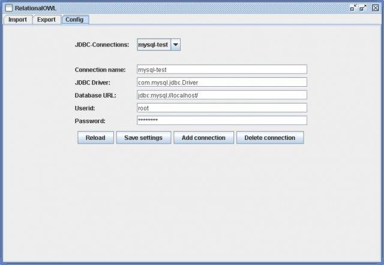
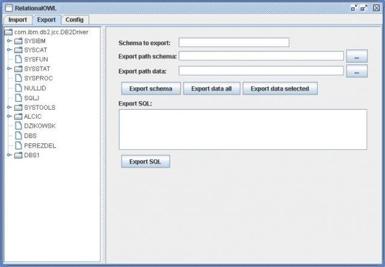
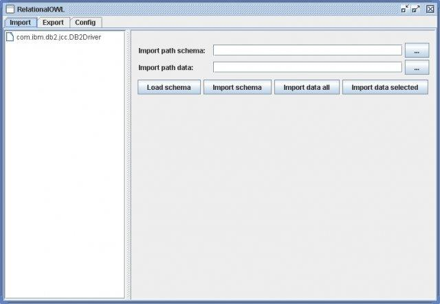

# Relational.OWL

Relational.OWL automatically extracts the semantics of virtually any relational database and transforms this information automatically into RDF/OWL, processable by a wide majority of Semantic Web applications.

## Screenshots

Configuring the JDBC-Connection:

Exporting a Schema and its Corresponding Data:

Importing Relational.OWL-Data into a Database:

## Links

https://sourceforge.net/projects/relational-owl/

https://www.dbs.cs.uni-duesseldorf.de/RDF/

http://crpit.com/confpapers/CRPITV43deLaborda.pdf